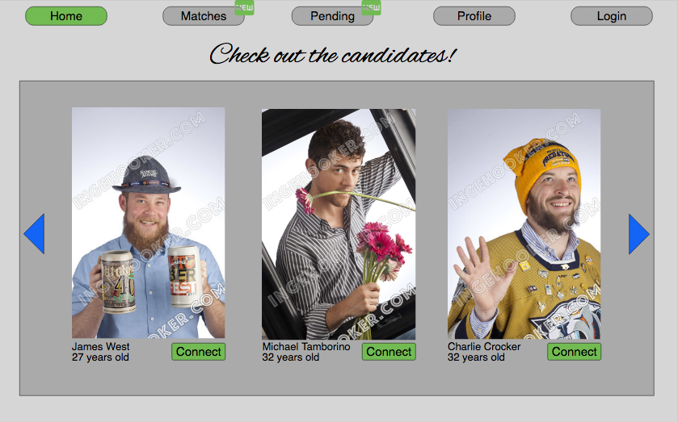
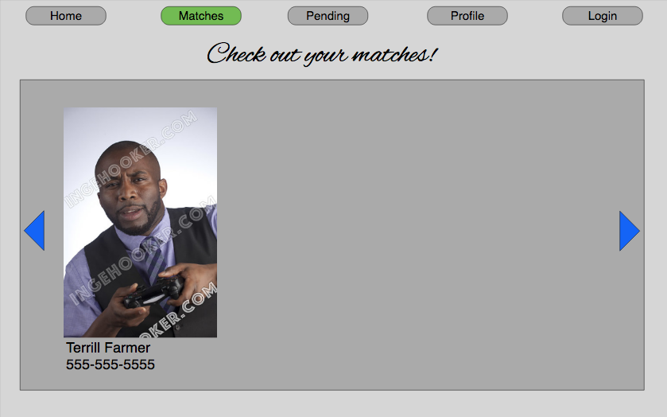
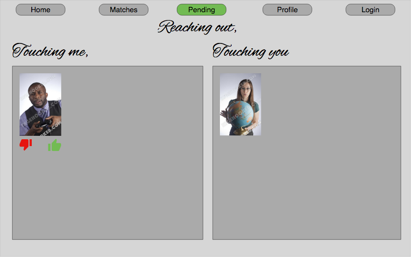
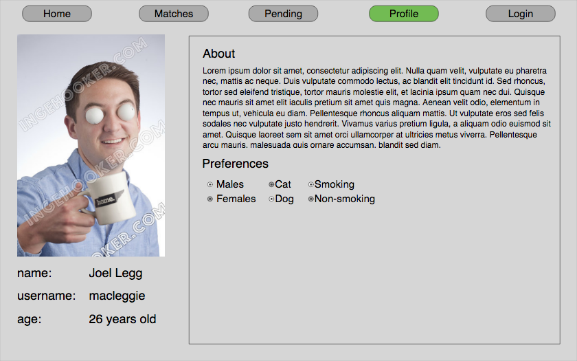
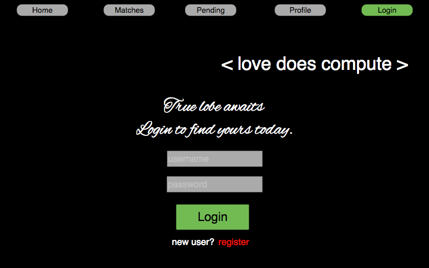
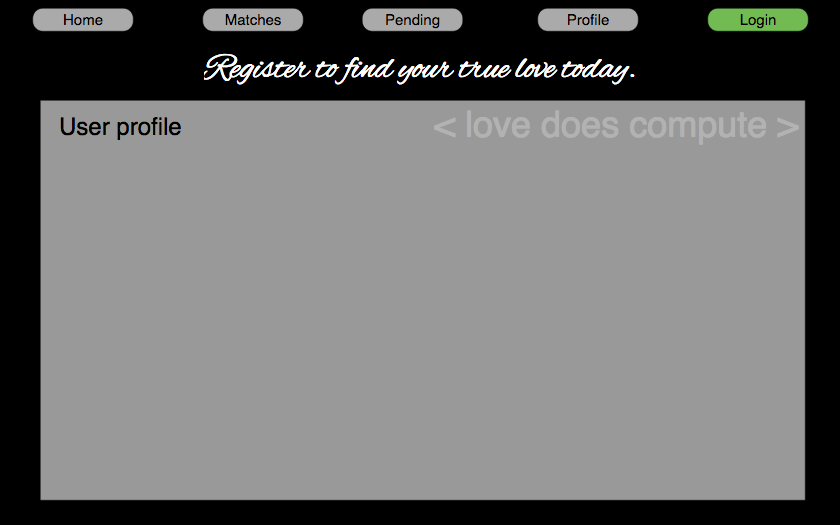
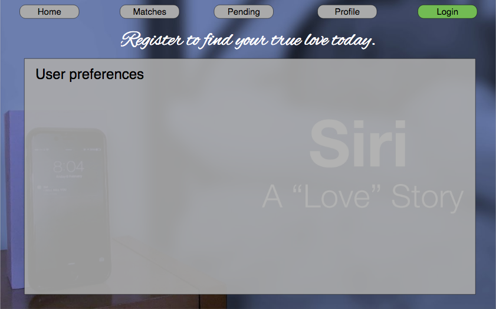

# okCoder

## okCoder is a dating website built using ExpressJS and Pug

## About

After months without any success in the dating app market, we have decided to rebrand our app and build it from the ground up. Using all of our Express skills, we've decided to create a server side app with user authentication, a PostgreSQL database, and PugJS for the view engine.

1. The home page for a user will list all available users profiles.

1. When a user first registers, they will be prompted to create a dating profile with personal information, likes and dislikes, etc.

1. A user will be able to browse all users and "like" a user who could be a potential date.

1. A user can view all of their liked choices from the "pending" page.

1. A user will login and be taken to their home page.

## Technologies

1. Use Knex, Bookshelf and PostgreSQL for the database and database ORM.

1. `Pug` as the view engine.

1. For session persistence we have used the following technologies: `express-session`, `passport`, `passport-local`, `connect-session-knex`.

1. Using `bookshelf-bcrypt` and `bcrypt`, we authenticate the users credentials on login and registration.

## ERD

## mock-ups

